# Unity 치지직 API 사용 설정법  
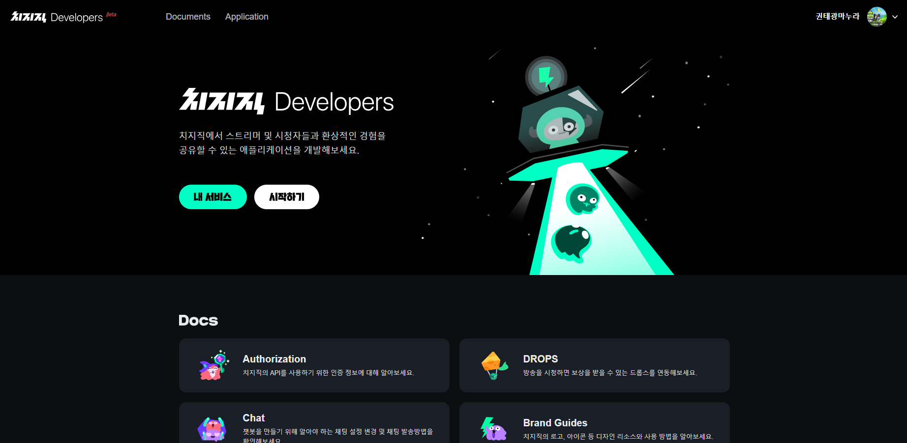
- 치지직Developers 검색 하여 사이트 진입
- 내서비스 클릭

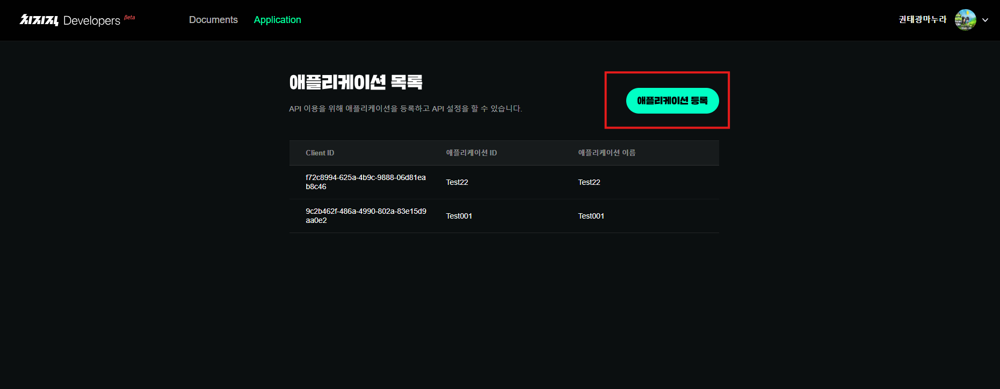

- 애플리케이션 등록 클릭

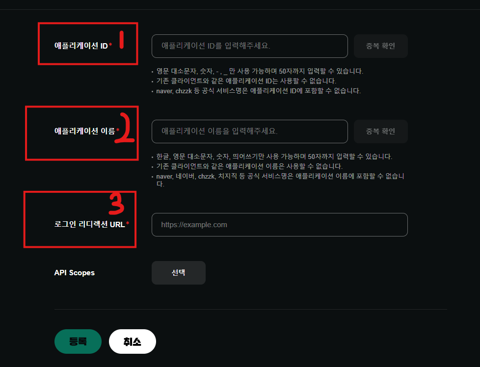
- 1 애플리케이션 ID 아무렇게나 등록
- 2.애플리케이션 이름 등록 
- 3.로그인 라디렉션 URL : http://localhost:8080/callback 로 등록
    - 로직에 해당 라디렉션 사용코드가 있어서 그냥 저걸로 통일하면 문제 없이 사용 가능

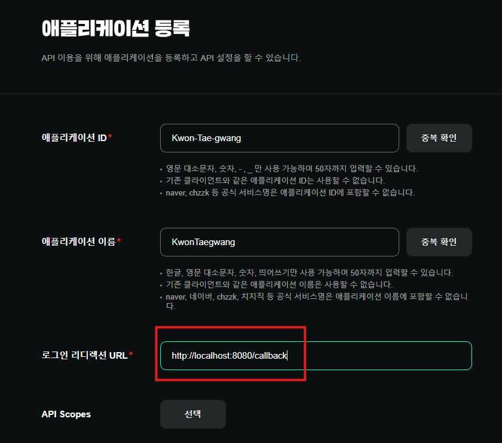
 
 
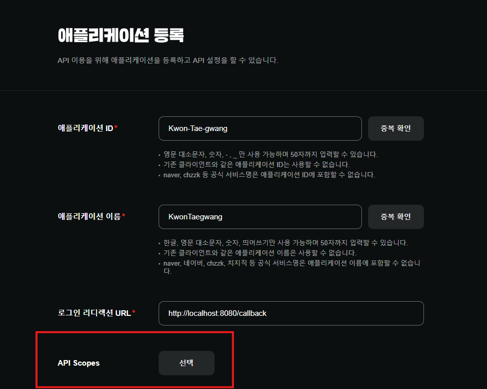
- API Scopes 클릭하면 사용할  api 선택하는게 있는데 사용자 원하는거 선택

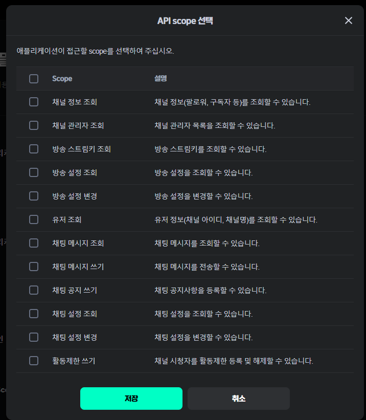

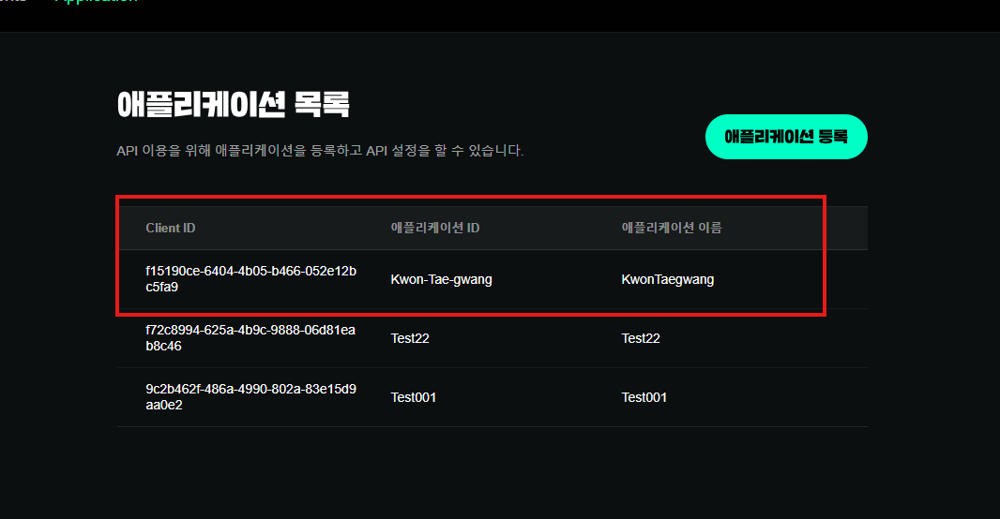
 API Scopes 저장하고 등록하면, 애플리케이션 목록에 등록이 되어 있을것이다.

 클릭을 하자.

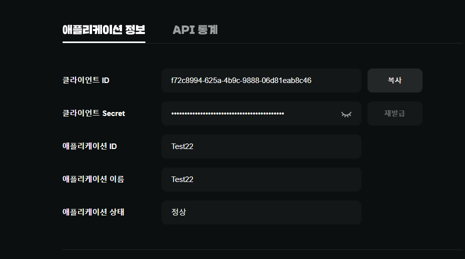

- 클라이언트 ID
- 클리언트 Secret 

두가지 값을 복사해 따로 적어두기.

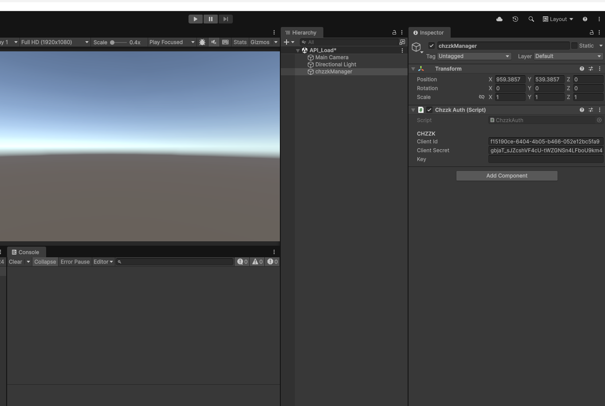
- 프로젝트로 들어가서  씬 하나를 만든다.
- 오브젝트에 Chzzk Auth 붙인다.
- 직렬화 된 Client id / client secret에 빼둔 값을 넣어준다.

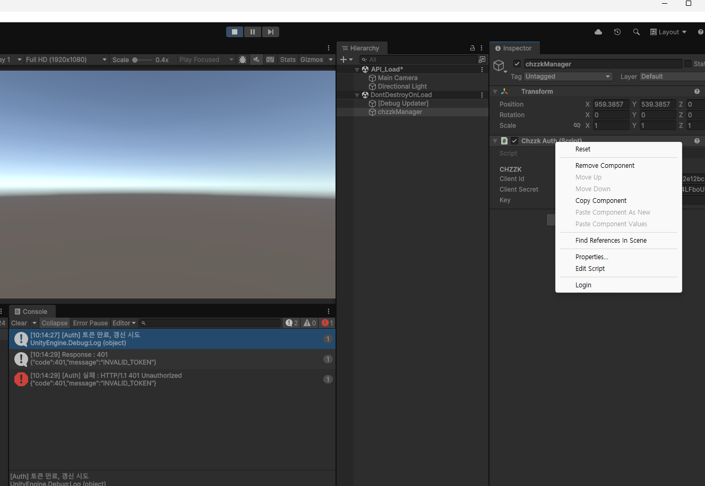

- 유니티 에디터 실행 후 Context메뉴를 실행해 준다 Login을 실행 해주면된다.

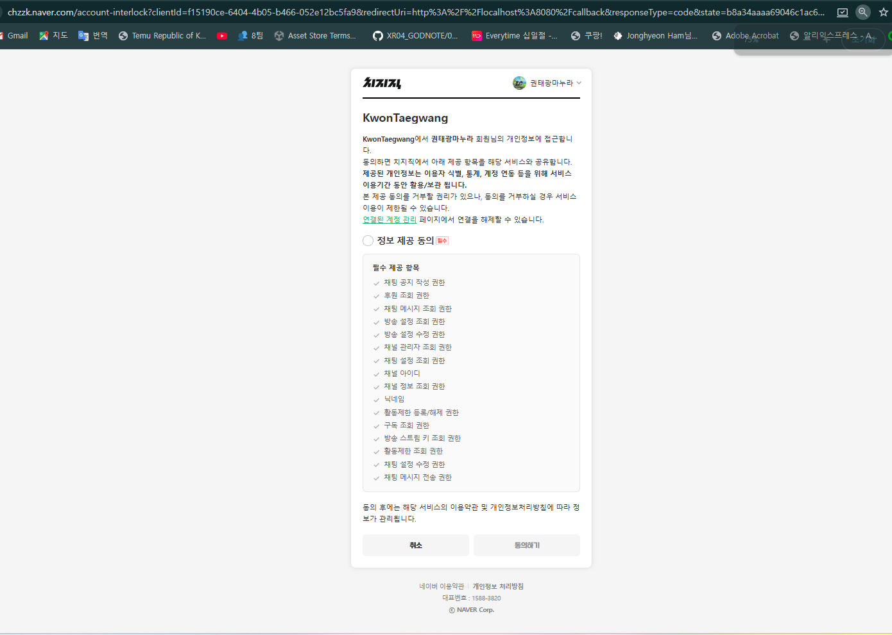
- 로그인 Context 메뉴를 실행 해주면  위에 사진과 같은 내용이 나온다
- 정보 제공 동의 클릭 후  동의 하기 클릭 해준다. 

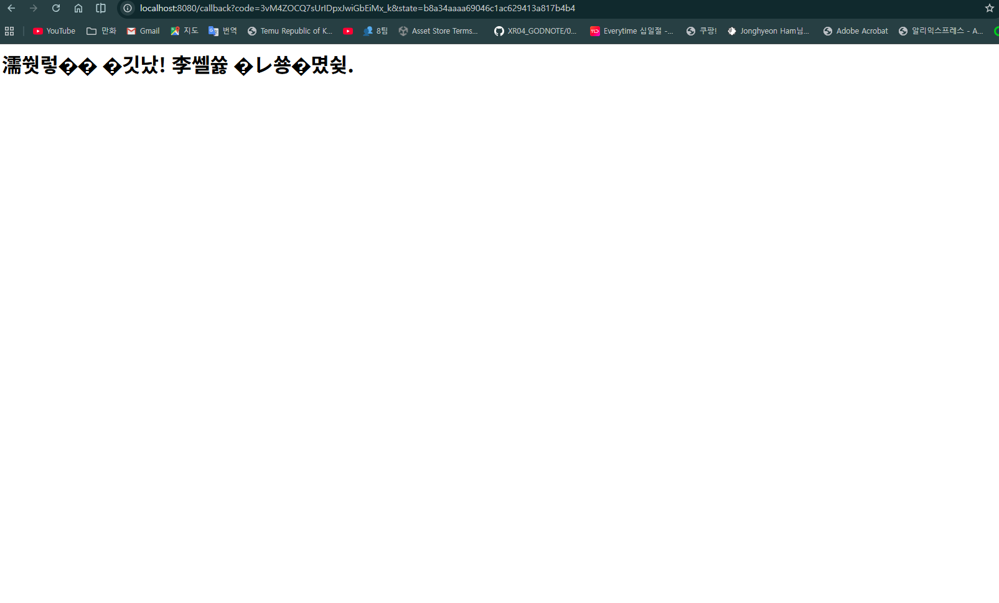

- 클릭 이후 사이즈가 갱신 되면서 이상하게 뜨는데 정상이다.

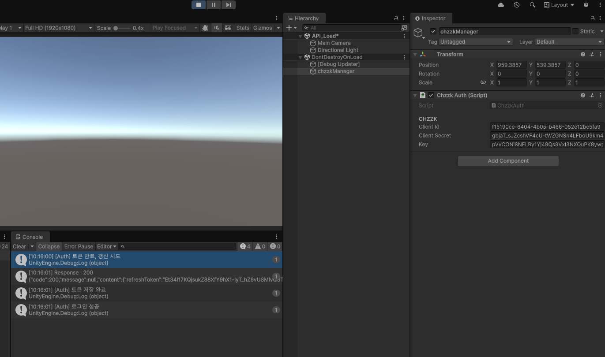

에디터 종료 후 재실행 하면 Auth 로그인 성공 이라고 뜨고
key값 에 값이 들어와 있을것이다.

이러면 사용 준비는 끝이난다.

## 비공식 api 사용법
https://github.com/JoKangHyeon/ChzzkUnity 들어가기
- uniTask 설치하기
- Newtonsoft 설치하기
- websocket.dll 프로젝트에 저장 (해당 내용은 참고용 git에 나와 있음)

참고용 git에서 가져와서 사용할 때 문제가 생겨서     
내가 코드 수정을 했다.  

내 프로젝트의 Unofficial API 폴더에 있는 코드를 사용하면 된다.

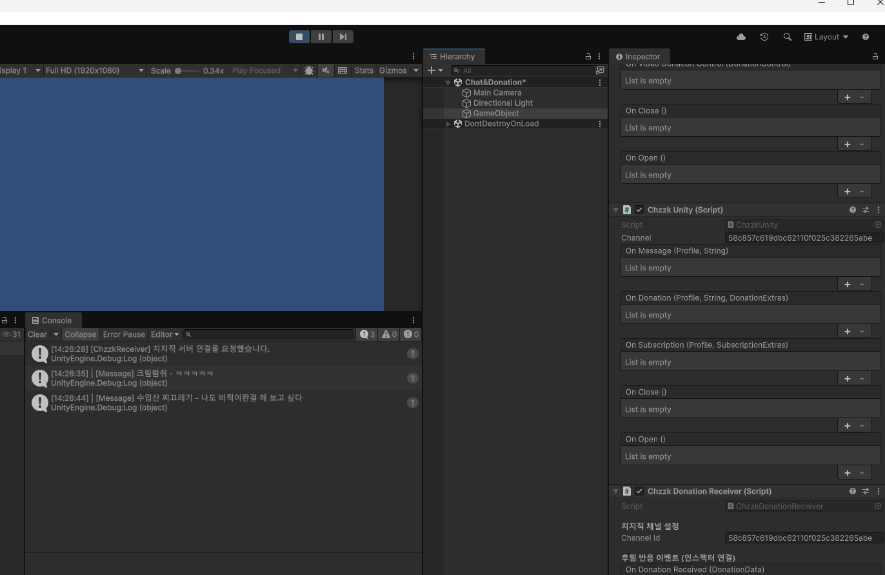

해당 기능 작동되는거 확인 후 작성 하였습니다.
----------------------------------
###  채팅 및 도네이션 API 참고용 git
https://github.com/JoKangHyeon/ChzzkUnity

### UniwindowController 사용법 기록 해 둔거
https://velog.io/@aaaggg/UniWindowController
